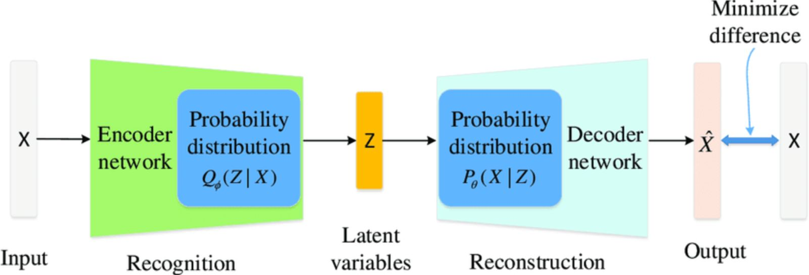

# Variational-Auto-Encoder-for-images
*By: Sebastian Higuera Pedraza*

This project will introduce the Variational Auto Encoder for processing images, using CelebA dataset in Python.


The aim of this project is to introduce the Variational Auto Encoder, both theoretically and practically, using Python.

For this purpose, I'll use CelebA data set, a very popular data set for training Deep Neural Networks. It is also commonly used for pedagogical purposes.

First, I'll introduce the traditional Autoencoder from the deep learning perspective, and afterwards I'll introduce the Variational Auto Encoder.

## Autoencoder 

As it is explained in Tenor Flow webpage, an autoencoder is simply a special type of deep neural network which is trained to replicate its input into its output. So essentially, this network learns how to represent the input data, like an image, into a lower dimension (latent) space, and then it learns how to reconstruct back the original input data, such that the reconstruction is as similar as possible to the original data.

The architecture of this Autoencoder is simple. First, there is an encoding process, where the input data (image) is transformed to a lower dimension space. So it takes the $x$ data points and use a neural network to generate an output $z$, where $z<n$. This output is living in a latent space of lower dimension and is merely a representation of the original data in a lower dimension space. The second part of the autoencoder is the decoder: it generates the process backwards. Therefore, the encoder compress the data, while the decoder reconstructs the data back to its original form.

An autoencoder consists of two main parts: the encoder and the decoder.

1. **Encoder:** This part of the network compresses the input into a latent-space representation. It can be represented as a function $f$ that maps an input $x$ to a hidden representation $z$: $z=f(x)$, where $f$ is just a neural network.
2. **Decoder:** This part of the network reconstructs the input data from the latent space representation. It can be represented as a function $g$ that maps the latent representation $z$ of $x$ to an approximation (reconstruction) $\hat{x} = g(z)$. The function $g$ is also a neural network that usually replicates the architecture of $f$, but backwards.

Therefore, the autoencoder is simply a composition of two functions: $\hat{x} = g(f(x))$. And its objective is to minimize the reconstruction error, which is the Mean Squared Error between $x$ and $\hat{x}$:

$$ \text{MSE} = \frac{1}{n} \sum_{i=1}^{n} (x_i - \hat{x}_i)^2 $$

With $n$ the number of samples.

### A Python application

For illustrating how the Autoencoder works, I'll use the CelebA data set. It is a large-scale face attributes dataset with more than 200.000 celebrity images, each with 40 attribute annotations. The images in this dataset cover 10,177 number of identities, 202,599 number of face images, and 5 landmark locations, 40 binary attributes annotations per image.

This dataset is normally used as a benchmark for training models specialized in computer vision tasks: face attribute recognition, face recognition, face detection, landmark (or facial part) localization, and face editing & synthesis. 

The following code will implement a basic Autoencoder for replicate some celebrity faces.

First, I need to import the necessary libraries and packages to use:

```python
import os
import zipfile 
import gdown
import torch
from natsort import natsorted
from PIL import Image
from torch.utils.data import Dataset
from torchvision import transforms
## Setup
# Number of gpus available
ngpu = 1
device = torch.device('cuda:0' if (
    torch.cuda.is_available() and ngpu > 0) else 'cpu')
```
Then, I'll upload the data set, which is located in a Google Drive folder. The following code is just for getting that data into the working space

```python
## Fetch data from Google Drive 
# Root directory for the dataset
data_root = 'data/celeba'
# Path to folder with the dataset
dataset_folder = f'{data_root}/img_align_celeba'
# URL for the CelebA dataset
url = 'https://drive.google.com/uc?id=1CeCv8rlc7OT8MHMTSr_uzfdbKop1a7pa'
# Path to download the dataset to
download_path = f'{data_root}/img_align_celeba.zip'
# Create required directories 
if not os.path.exists(data_root):
  os.makedirs(data_root)
  os.makedirs(dataset_folder)
# Download the dataset from google drive
gdown.download(url, download_path, quiet=False)
# Unzip the downloaded file 
with zipfile.ZipFile(download_path, 'r') as ziphandler:
  ziphandler.extractall(dataset_folder)
```
Then, I will create a Dataset class in Python, for reading the images and loading the data ready to be used.

```python
## Create a custom Dataset class
class CelebADataset(Dataset):
  def __init__(self, root_dir, transform=None):
    """
    Args:
      root_dir (string): Directory with all the images
      transform (callable, optional): transform to be applied to each image sample
    """
    # Read names of images in the root directory
    image_names = os.listdir(root_dir)

    self.root_dir = root_dir
    self.transform = transform 
    self.image_names = natsorted(image_names)

  def __len__(self): 
    return len(self.image_names)

  def __getitem__(self, idx):
    # Get the path to the image 
    img_path = os.path.join(self.root_dir, self.image_names[idx])
    # Load image and convert it to RGB
    img = Image.open(img_path).convert('RGB')
    # Apply transformations to the image
    if self.transform:
      img = self.transform(img)

    return img

## Load the dataset 
# Path to directory with all the images
img_folder = f'{dataset_folder}/img_align_celeba'
# Spatial size of training images, images are resized to this size.
image_size = 64
# Transformations to be applied to each individual image sample: resizing, cropping, converting to a tensor and normalizing
transform=transforms.Compose([
    transforms.Resize(image_size),
    transforms.CenterCrop(image_size),
    transforms.ToTensor(),
    transforms.Normalize(mean=[0.5, 0.5, 0.5],
                          std=[0.5, 0.5, 0.5])
])
# Load the dataset from file and apply transformations
celeba_dataset = CelebADataset(img_folder, transform)
```
The last step before training the model, is creating a data loader of the CelebA data set. This will import a number of images (batch size) for training the autoencoder, instead of training the model with the whole dataset.

```python
## Create a dataloader 
# Batch size during training
batch_size = 128
# Number of workers for the dataloader
num_workers = 0 if device.type == 'cuda' else 2
# Whether to put fetched data tensors to pinned memory
pin_memory = True if device.type == 'cuda' else False

celeba_dataloader = torch.utils.data.DataLoader(celeba_dataset,
                                                batch_size=batch_size,
                                                num_workers=num_workers,
                                                pin_memory=pin_memory,
                                                shuffle=True)
```

Now, I'll split the dataset into a training and a test set, using the data loader class previously coded:

```python
from torch.utils.data import random_split
# Define the proportion or size of the test set
test_size = 0.2  # for example, 20% of the dataset
total_size = len(celeba_dataset)
test_size = int(test_size * total_size)
train_size = total_size - test_size
# Split the dataset
train_dataset, test_dataset = random_split(celeba_dataset, [train_size, test_size])
# Create DataLoaders for train and test sets
train_loader = torch.utils.data.DataLoader(train_dataset, batch_size=batch_size, shuffle=True, num_workers=0)
test_loader = torch.utils.data.DataLoader(test_dataset, batch_size=batch_size, shuffle=False, num_workers=0)

```

And finally, here I code the Autoencoder structure: first, I initialize the model, then I define the encoder as a convolutional neural network (a neural network that applies convolutional layers, very useful when working with images), and then I define the decoder as another convolutional neural network, with the same structure as the encoder, but reversed. The autoencoder will be just the application of both the encoder and the decoder.

```python
#### Autoencoder structure #####
import torch
import torch.nn as nn
import torch.nn.functional as F

class Autoencoder(nn.Module):
    def __init__(self):
        super(Autoencoder, self).__init__()
        # Encoder
        self.encoder = nn.Sequential(
            nn.Conv2d(3, 16, 3, stride=2, padding=1),  # [batch, 16, 32, 32]
            nn.ReLU(),
            nn.Conv2d(16, 32, 3, stride=2, padding=1), # [batch, 32, 16, 16]
            nn.ReLU(),
            nn.Conv2d(32, 64, 7)                      # [batch, 64, 10, 10]
        )
        
        # Decoder
        self.decoder = nn.Sequential(
            nn.ConvTranspose2d(64, 32, 7),           # [batch, 32, 16, 16]
            nn.ReLU(),
            nn.ConvTranspose2d(32, 16, 3, stride=2, padding=1, output_padding=1), # [batch, 16, 32, 32]
            nn.ReLU(),
            nn.ConvTranspose2d(16, 3, 3, stride=2, padding=1, output_padding=1),   # [batch, 3, 64, 64]
            nn.Sigmoid()  # Using Sigmoid to scale the output to [0,1]
        )

    def forward(self, x):
        x = self.encoder(x)
        x = self.decoder(x)
        return x
```
For training the autoencoder, I define first the initialization, the loss function which is in this case the MSE, and the optimizer, which is Adam, with a learning rate of 0.001. The training will last 5 epochs and will iterate over each batch of the training set such that it minimizes the loss function.

```python
# Autoencoder initialization
autoencoder = Autoencoder().to(device)

# Define the Loss Function and Optimizer
criterion = nn.MSELoss()
optimizer = torch.optim.Adam(autoencoder.parameters(), lr=1e-3)
### Train the autoencoder
num_epochs = 5  
for epoch in range(num_epochs):
    for data in train_loader:  # Iterate over each batch in the DataLoader
        img = data.to(device)  # Move the data to the device
        # Forward pass
        output = autoencoder(img)
        loss = criterion(output, img)
        
        # Backward pass and optimize
        optimizer.zero_grad()
        loss.backward()
        optimizer.step()
        
    print(f'Epoch [{epoch+1}/{num_epochs}], Loss: {loss.item():.4f}')
```

Finally, I'll evaluate the performance of the Autoencoder in the test set. For such purpose, I'll compare a sample of the original images with their respective reconstructed images, and compute the average reconstruction error over the test set:

```python
### Evaluate autoencoder
with torch.no_grad():  # No need to track gradients
    for data in test_loader:
        img = data.to(device)
        output = autoencoder(img)
        # Compare output images with original images
import matplotlib.pyplot as plt
import numpy as np

# Function to convert a tensor to a numpy image
def to_img(x):
    x = 0.5 * (x + 1)  # Unnormalize
    x = x.clamp(0, 1)
    x = x.view(x.size(0), 3, 64, 64)
    return x.detach().cpu().numpy()

# Switch model to evaluation mode
autoencoder.eval()

# Calculate the loss - here we're using MSE
mse_loss = nn.MSELoss()
total_loss = 0.0

# We'll also visualize some of the outputs
num_images_to_show = 5
fig, axes = plt.subplots(nrows=2, ncols=num_images_to_show, figsize=(10, 4))

# Use the first `num_images_to_show` images from the test_loader
for i, data in enumerate(test_loader):
    img = data.to(device)
    output = autoencoder(img)
    loss = mse_loss(output, img)
    total_loss += loss.item()

    # Only plot the first batch of images
    if i == 0:
        # Convert the images to a displayable format
        original_images = to_img(img)
        reconstructed_images = to_img(output)

        # Plot original and reconstructed images
        for k in range(num_images_to_show):
            axes[0, k].imshow(np.transpose(original_images[k], (1, 2, 0)))
            axes[0, k].set_title('Original')
            axes[0, k].axis('off')

            axes[1, k].imshow(np.transpose(reconstructed_images[k], (1, 2, 0)))
            axes[1, k].set_title('Reconstructed')
            axes[1, k].axis('off')

        plt.show()

        break  # We only want to visualize one batch

# Calculate the average loss per image
average_loss = total_loss / len(test_loader.dataset)
print(f'Average reconstruction error: {average_loss}')
```

The results show that the average reconstruction error is quite small, 6.0968116286558865e-06, and the reconstructed images are quit similar to the original ones. So the autoencoder works well. The results can be found in the .ipynb file attached to this project.

## Variational Auto Encoder

This is another type of autoencoder which relies on probabilistic modelling of the data. As it is clearly stated by Alexander Van de Kleut in his GitHub, traditional autoencoders map the input data into a latent vector space, but not necesarily those latent vectors are easy to decode back to the original feature space. The fact that the encoding maps deterministically the input into the latent space, this space might become disjoint and non-continuous. That can make harder the decoding process, and it will be harder to generate new data. For solving that issue, variational autoencoders (VAE) map input data to a **probability distribution** over the latent space. Then latent vectors are sampled from that encoded distribution. This makes easier and more robust the process of decoding and thus reconstructing the original data, and also allows to generate some new data.




More formally, a VAE will map the vector $x$ not into a latent vector $z=f(x)$, but to a probability distribution defined over latent vectors. It's common to use the normal distribution, which is parametrized by $\mu$ and $\sigma$. So, the encoding part of the VAE will map $x$ to both $\mu(x)$ and $\sigma(x)$, thus mapping $x$ to a complete distribution $N(\mu(x),\sigma(x))$. Then, it will be easy to sample latent vectors from such distribution. This is done by introducing in the encoding layer of the neural network two hidden layers, one with an output $\mu(x)$ and the other one with the output $\sigma(x)$. 

It is important that when mapping the data $x$ to the normal distribution, there's some stability in the means and variances mapped for each data point. As Van de Kleut stated, "the outputted means may be significantly different and the standard deviations may be too small." For solving that issue, a prior distribution of the latent vector is introduced. This prior will reflect the desired structure that the latent space must have, thus ensuring a good behavior of the outputs. It is common to chose a standard normal distribution for that purpose. Therefore, the loss function not only need to account for the reconstruction error, but also need to take into account this regularization term. For that purpose, the Kullback–Leibler divergence is introduce. This is just a type of statistical distance between two distributions. So, if we want that the output distributions over the latent space be as close as possible to that prior distribution, we need to minimize the KL divergence between the encoded distribution of latent vectors and the desired prior distribution. Therefore, if we add to the traditional loss function (reconstruction error) this KL divergence, we get a new loss function for the VAE, called the Evidence Lower Bound function for VAE:

$$\text{ELBO} = \mathbb{E}_{q_\phi(z|x)}[\log p_\theta(x|z)] - D_{KL}(q_\phi(z|x) \| p(z))$$

Where $\log p_\theta(x|z)$ is the log likelihood of accurately reconstructing the input data from the latent variables, which we want to maximize (with $\theta=(0,1)$); $\mathbb{E}_{q_\phi(z|x)}$ is the expected value over the distribution of the latent variables 
$z$, as given by the encoder's output $q_\phi(z|x)$, where $\phi=(\mu,\sigma)$; and $D_{KL}(q_\phi(z|x) \| p(z))$ is the KL divergence between the prior $p(z)$ and the encoder's output, which we want to minimize. Therefore, we will want to maximize the ELBO, or minimize -ELBO, for training correctly the VAE.

There is also a nice trick for training correctly the VAE. Since we use backpropagation for training the model, and backpropagation doesn't work on stochastic objects, it is important to turn the stochastic nature of the sampled latent vectors, to a more 'deterministic' objects. This is called the 'reparametrization trick', and basically changes how the sample is done. So, instead of sampling directly over $q_\phi(z|x)$, we sample over an auxiliary variable $e$ from a distribution $P(e)$ which is not parametrized by $\phi$, and then transform those auxiliary variables through a deterministic function that also depends on $\phi$.

For this trick, it is normally assumed that $P(e)$ is a standard normal distribution, and then construct deterministically the latent vector as following: $z=\mu(x)+\sigma(x)*e_i$, where $e_i$ is sampled from $P(e)$. This will ensure that $z$ is constructed 'deterministically', but conserving it natural randomness, and that it is also distributed as a $N(\mu(x),\sigma(x))$. This trick will enable using backpropagation, as it ensure differentiability. 

Now, I'll implement the VAE over the same CelebA dataset, by just modifying the previous autoencoder with a different loss, which is now the ELBO, and different hidden convolutional layers in the encoding:

```python
class VAE(nn.Module):
    def __init__(self):
        super(VAE, self).__init__()
        # Encoder
        self.enc_conv1 = nn.Conv2d(3, 16, 3, stride=2, padding=1)
        self.enc_conv2 = nn.Conv2d(16, 32, 3, stride=2, padding=1)
        self.enc_conv3 = nn.Conv2d(32, 64, 7)
        # This represents the fully connected layers that output the mean and log-variance
        self.fc_mu = nn.Linear(in_features=64*10*10, out_features=latent_dim)
        self.fc_logvar = nn.Linear(in_features=64*10*10, out_features=latent_dim)
        # Decoder
        self.dec_fc = nn.Linear(in_features=latent_dim, out_features=64*10*10)
        self.dec_conv1 = nn.ConvTranspose2d(64, 32, 7)
        self.dec_conv2 = nn.ConvTranspose2d(32, 16, 3, stride=2, padding=1, output_padding=1)
        self.dec_conv3 = nn.ConvTranspose2d(16, 3, 3, stride=2, padding=1, output_padding=1)

    def reparameterize(self, mu, logvar):
        std = torch.exp(0.5*logvar)
        eps = torch.randn_like(std)
        return mu + eps*std

    def encode(self, x):
        x = F.relu(self.enc_conv1(x))
        x = F.relu(self.enc_conv2(x))
        x = F.relu(self.enc_conv3(x))
        x = x.view(x.size(0), -1)  # Flatten the output for the fully connected layers
        mu = self.fc_mu(x)
        logvar = self.fc_logvar(x)
        return mu, logvar

    def decode(self, z):
        z = self.dec_fc(z)
        z = z.view(z.size(0), 64, 10, 10)  # Unflatten z to match the shape after the last conv layer in the encoder
        z = F.relu(self.dec_conv1(z))
        z = F.relu(self.dec_conv2(z))
        z = torch.sigmoid(self.dec_conv3(z))  # Sigmoid activation to get the output between 0 and 1
        return z

    def forward(self, x):
        mu, logvar = self.encode(x)
        z = self.reparameterize(mu, logvar)
        return self.decode(z), mu, logvar

# Is important  to set latent_dim, which is a hyperparameter representing the size of the latent space and can be modified
latent_dim = 80  # for example

# VAE initialization
vae = VAE().to(device)

# We modify the loss function to include the KL divergence

def loss_function(recon_x, x, mu, logvar):
    # Ensure the reconstructed output has the same shape as the input
    # Assuming the input x has a shape of [batch_size, channels, height, width]
    recon_x = recon_x.view_as(x)  # Reshape recon_x to have the same shape as x

    MSE = F.mse_loss(recon_x, x, reduction='sum')
    KLD = -0.5 * torch.sum(1 + logvar - mu.pow(2) - logvar.exp())
    return MSE + KLD

# The optimizer stays the same
optimizer = torch.optim.Adam(vae.parameters(), lr=1e-3)

# And the training loop changes to accommodate the VAE loss
for epoch in range(5):
    for data in train_loader:
        img = data.to(device)
        optimizer.zero_grad()
        recon_batch, mu, logvar = vae(img)
        loss = loss_function(recon_batch, img, mu, logvar)
        loss.backward()
        optimizer.step()
        
    print(f'Epoch [{epoch+1}/{5}], Loss: {loss.item()/len(img):.4f}')
```

The rest of the code will be exactly as in the AutoEncoder. I'll evaluate the performance of the model on the test set, based both on the average loss, the R2 score and a visual inspection of the reconstructed faces vs. the original faces for a sample of images in the test set.

```python
import matplotlib.pyplot as plt
import torch
import numpy as np

# Switch the model to evaluation mode
vae.eval()

# For visualizing images, select few individual images
num_images_to_visualize = 5

# Track the total MSE
total_mse = 0.0
num_images = 0

# Visualization setup
fig, axes = plt.subplots(2, num_images_to_visualize, figsize=(10, 4))

with torch.no_grad():
    for i, data in enumerate(test_loader):
        if i >= num_images_to_visualize:
            break
        img = data.to(device)
        recon, _, _ = vae(img)
        
        # Calculate the MSE loss
        mse_loss = F.mse_loss(recon, img, reduction='sum').item()
        total_mse += mse_loss
        num_images += img.size(0)
        
        # Display original images
        axes[0, i].imshow(np.transpose(img[0].cpu().numpy(), (1, 2, 0)))
        axes[0, i].set_title('Original')
        axes[0, i].axis('off')
        
        # Display reconstructed images
        axes[1, i].imshow(np.transpose(recon[0].cpu().numpy(), (1, 2, 0)))
        axes[1, i].set_title('Reconstructed')
        axes[1, i].axis('off')

# Calculate the average MSE
average_mse = total_mse / num_images
print(f'Average MSE: {average_mse}')

plt.tight_layout()
plt.show()
```

For finishing the construction of an efficient autoencoder, it is important to tune optimally the hyper-parameters. This involves selecting the number of hidden/latent dimensions, the number of convolutional layers (with their respective hyper-parameters), the learning rate, the number of epochs, etc. It can be done using some type of search algorithm and Cross Validation (CV), such as a Grid Search CV. This is not done here because it took a lot of time for training and tuning the optimal parameters of the VAE. But in the Jupyter notebook file, the code for a grid search of only the latent dimensions is provided.


The present Report was done thanks to the clear explanation of different source and authors, who are listed below and can be consulted for deeper explanations:

[ELBO derivation for VAE](URL "https://abhinavkumarv29.medium.com/elbo-derivation-for-vae-variational-autoencoder-bb048fa1f55e")


[Understanding VAE](URL "https://towardsdatascience.com/understanding-variational-autoencoders-vaes-f70510919f73")

[Variational Auto Encoders](URL "https://avandekleut.github.io/vae/")


